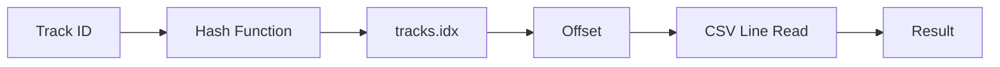

# 🎵 Top Tracks Search 🔍

<div align="center">


**Buscador ultrarrápido de canciones del Top 200 de Spotify usando CSV + índices en disco**

[🚀 Características](#-características) • [📁 Estructura](#-estructura-del-proyecto) • [⚙️ Instalación](#️-instalación) • [🎮 Uso](#-uso) • [🔧 Desarrollo](#-desarrollo)

</div>

## ✨ Características

<div align="center">

| 🚀 Velocidad | 🔍 Búsqueda | 💾 Optimización |
|-------------|-------------|-----------------|
| **Búsqueda O(1)** por track_id | **1-3 palabras** con operador AND | **Índices en disco** sin cargar dataset completo |
| **Acceso directo** a registros | **Insensible** a mayúsculas/tildes | **Formato compacto** de salida |

</div>

## 🏗️ Estructura del Proyecto

```bash
top-tracks-search/
├── 📁 src/
│   ├── 🎮 p1-dataProgram.c         # Programa principal (menú)
│   ├── 🗂️ build_idx_trackid.c      # Índice por track_id → tracks.idx
│   ├── 📖 build_name_index.c       # Índice invertido → nameidx/
│   ├── 🔍 lookup_trackid.c         # Utilidad: búsqueda por ID
│   ├── 📝 search_name.c            # Utilidad: búsqueda por palabras
│   ├── 🖥️ track_server.c           # Servidor FIFO (opcional)
│   └── 💻 track_client.c           # Cliente FIFO (opcional)
├── 🔧 Makefile
├── 📄 README.md
└── 🚫 .gitignore
```

## ⚡ Instalación Rápida

### Prerrequisitos
```bash
# Ubuntu/Debian
sudo apt update && sudo apt install build-essential

# CentOS/RHEL
sudo yum groupinstall 'Development Tools'
```

### 🛠️ Compilación
```bash
# Clona el repositorio
git clone https://github.com/tu-usuario/top-tracks-search.git
cd top-tracks-search

# Compila todo el proyecto
make

# O compila utilidades específicas
make build_idx build_name_index lookup search_name
```

## 📥 Dataset

### Opción A: Descarga Automática
```bash
# Configura tu URL en Makefile y ejecuta:
make fetch-data
```

### Opción B: Descarga Manual
Coloca `merged_data.csv` en la raíz del proyecto.

> **⚠️ Nota**: Si cambias el CSV, reconstruye los índices con `make indexes`

## 🗂️ Construcción de Índices

```bash
# Índice hash para track_id (O(1))
./build_idx merged_data.csv tracks.idx

# Índice invertido para nombre/artista
./build_name_index merged_data.csv nameidx

# O automatiza ambos
make indexes
```

## 🎮 Uso

### Ejecutar Programa Principal
```bash
./p1-dataProgram
```

### 🎯 Ejemplos de Búsqueda

#### 🔎 Por Track ID
```bash
# Menú interactivo
1 → 6rQSrBHf7HLZjtcMZ4S4b0
4 → Ejecutar
```

#### 🎵 Por Nombre/Artista
```bash
# Búsqueda con múltiples palabras (AND)
2 → reggaeton
3 → lento
4 → Ejecutar
```

> **🎉 Característica**: Búsqueda insensible a mayúsculas y tildes → `Beyoncé` == `beyonce`

### 🛠️ Utilidades de Línea de Comandos

```bash
# Búsqueda directa por track_id
./lookup merged_data.csv tracks.idx "6rQSrBHf7HLZjtcMZ4S4b0"

# Búsqueda por palabras clave
./search_name merged_data.csv nameidx "reggaeton" "lento"

# Demo cliente-servidor (opcional)
./track_server &
./track_client
```

## 🧰 Comandos Makefile

| Comando | Descripción |
|---------|-------------|
| `make` | Compila el programa principal |
| `make indexes` | Construye todos los índices |
| `make fetch-data` | Descarga el dataset |
| `make clean` | Limpia archivos compilados |
| `make dist` | Empaqueta para entrega |

## 🔧 Desarrollo

### 🏗️ Arquitectura Interna

#### Búsqueda por Track ID


#### Búsqueda por Texto


### 🐛 Solución de Problemas

| Problema | Solución |
|----------|----------|
| `NOT_FOUND` en búsqueda por ID | `make indexes` |
| `nameidx/` vacío o faltante | `./build_name_index merged_data.csv nameidx` |
| Descarga OneDrive falla | Verifica URL directa en `Makefile` |
| CSV muy grande/lento | Asegura que esté en disco local |

## 🤝 Contribuir

¡Las contribuciones son bienvenidas! 

1. 🍴 Haz fork del proyecto
2. 🌿 Crea una rama feature (`git checkout -b feature/AmazingFeature`)
3. 💬 Commit tus cambios (`git commit -m 'Add AmazingFeature'`)
4. 🚀 Push a la rama (`git push origin feature/AmazingFeature`)
5. 🔄 Abre un Pull Request


## 👨‍💻 Autor

**Tu Nombre**
pbueno@unal.edu.co
jyanezf@unal.edu.co

LinkedIn: www.linkedin.com/in/pabloandresbuenolopez

---

<div align="center">

### ⭐ ¿Te gusta este proyecto? Dale una estrella en GitHub!

**¿Preguntas o sugerencias?** ¡Abre un issue o envíame un mensaje!

</div>
